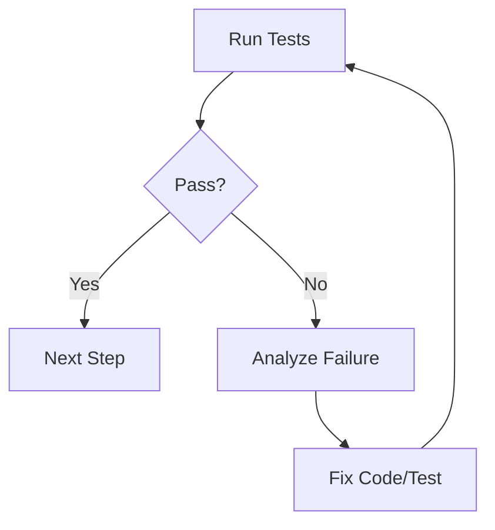

# Deep Refactoring Workflow (Full Stack)

此工作流用于指导涉及后端架构（Go/Gin）、数据库模型（PostgreSQL）、缓存策略（Redis）及前端交互（React）的复杂重构。

**核心原则**：小步快跑，数据优先，接口契约，循环验证。

## 1. Preparation & Analysis (准备与分析)
*在触碰任何代码之前，必须建立全景图。*

1.  **Define the "Why" & "What"**:
    -   明确重构目标（例如：从 MVC 转向 Clean Architecture，优化 SQL 慢查询，拆分 React 巨型组件）。
    -   **Scope Definition**: 明确列出受影响的 Go package、React 组件树、PG 表结构以及 Redis Key 模式。

2.  **Dependency Mapping**:
    -   **Go**: 使用工具可视化 Go 依赖关系，识别循环依赖。
    -   **Database**: 检查 PG 表的外键约束、索引以及存储过程。
    -   **Data Flow**: 追踪数据流向：`React UI -> API -> Go Logic -> Redis Cache -> PG DB`。

3.  **Baseline Establishment**:
    -   **Snapshot**: 记录当前的性能指标（API 延迟、数据库 CPU、前端渲染时间）。
    -   **Coverage Check**: 运行 `go test -cover` 和前端测试。
    -   **Safety Net**: 如果目标模块缺乏测试，必须先编写“特征测试（Characterization Tests）”或端到端（E2E）测试来锁定当前行为。

## 2. Planning (策划阶段)
1.  **Create `implementation_plan.md`**:
    -   **Architecture Diagram**: 画出 Before/After 架构图。
    -   **Database Migration**:
        -   PG Schema: 编写 Up/Down SQL 脚本。
        -   Data Migration: 定义如何迁移旧数据（双写策略 vs 停机迁移）。
    -   **Redis Strategy**: 定义缓存失效策略（Invalidate vs Update）。重构后旧缓存 Key 是否兼容？
    -   **API Contract**: 如果 API 变动，先定义 DTO 结构，并通知前端。
    -   **Rollback Strategy**: 定义失败恢复方案（如：Feature Flag 开关，数据库快照恢复）。

2.  **Review**:
    -   提交计划给 Team Lead 或架构师审查，或使用 `notify_user` 获取确认。

## 3. Execution: Backend Layer (Go + Data)
*遵循“数据层 -> 逻辑层 -> 接口层”的顺序。*

1.  **Data Layer (PostgreSQL & Redis)**:
    -   **Schema Change**: 优先执行非破坏性的 DB 迁移（例如：添加列而不是重命名列）。
    -   **Repo Pattern**: 重构 Go 的 Repository 层。确保 SQL 查询与业务逻辑解耦。
    -   **Cache Layer**: 封装 Redis 操作。确保所有 Key 都有统一定义，避免硬编码字符串。

2.  **Domain/Business Logic**:
    -   **Pure Functions**: 将业务逻辑从 HTTP Handler 中剥离，转为独立的 Service/UseCase。
    -   **Dependency Injection**: 使用 Interface 定义依赖，便于 Mock 测试。

3.  **Refactoring Cycle (The Loop)**:
    -   `修改一小块 -> go test ./... -> 修复编译错误 -> 提交 (Git Commit)`。
    -   **注意**：切勿一次性重构所有 Package。

## 4. Execution: Frontend Layer (React)
*在后端 API 稳定或 Mock 完成后开始。*

1.  **Type Sync**:
    -   根据新的 Go Struct 更新 TypeScript Interface/Types。

2.  **Component Decomposition**:
    -   **Logic Extraction**: 将 API 调用和状态管理提取到 Custom Hooks (`useOrder`, `useAuth`)。
    -   **UI Isolation**: 确保 Presentational Components 不包含业务逻辑。

3.  **State Management**:
    -   更新 React Query / Context 以适配新的 API 响应结构。

## 5. Verification Loop (循环验证与修复)
*这是最关键的阶段。验证失败必须立即修复，不可跳过。*

### 5.1 The Loop Process

### 5.2 Specific Checks
1.  **Unit Test Verification**:
    -   **Go**: `go test -race ./...` (检查并发竞争)。
    -   **React**: `npm test` (Jest/Vitest)。

2.  **Integration Verification (Go + PG + Redis)**:
    -   启动 Docker Compose 环境。
    -   测试真实数据库交互：写入 PG，检查 Redis 缓存是否同步/失效。
    -   **Transaction Check**: 模拟错误情况（如 Panic），验证数据库事务是否正确 Rollback。

3.  **Critical Path Verification (E2E)**:
    -   手动或自动（Playwright）走通核心流程（如：登录 -> 创建资源 -> 刷新列表）。
    -   检查 React 前端是否因为 API 字段类型变更而白屏（White Screen of Death）。

4.  **Performance Verification**:
    -   检查重构后的 SQL 是否触发了 Full Table Scan（使用 `EXPLAIN ANALYZE`）。
    -   检查 React 是否存在多余的 Re-render。

**Exit Condition**: 所有测试通过，且核心流程在环境运行无误。

## 6. Cleanup & Documentation
1.  **Code Cleanup**:
    -   删除被弃用的 Go 结构体、无用的 React 组件、过期的 Redis Keys。
    -   删除临时 Feature Flags。

2.  **Database Cleanup**:
    -   在确认新数据结构稳定后，归档或删除旧表/旧列（通常滞后 1-2 个版本进行）。

3.  **Update Documentation**:
    -   更新 `GEMINI.md`, `API.md`。
    -   为复杂的 Go 逻辑添加 Godoc 注释。

4.  **Final Summary**:
    -   更新 `walkthrough.md`：记录重构前后的差异，以及学到的教训（Post-mortem）。