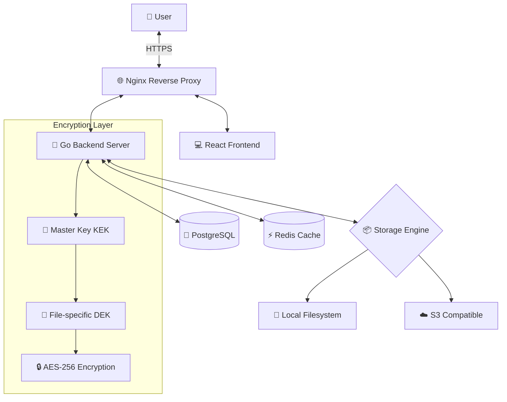

# AhaVault - Claude AI 协作指南

**项目名称**: AhaVault - 安全文件分享系统
**版本**: v0.1.0 (开发中)
**PRD 版本**: v1.2 (已定稿)
**最后更新**: 2026-02-04

> 📌 **目的**: 本文档旨在建立稳定、可持续演进的人机协作规范体系，确保知识完整沉淀为文档而非仅存在于代码或对话中。

---

## 📋 项目概述

### 🎯 核心定位

**AhaVault** 是一个私有化、轻量级、极致安全的 Web 文件分享系统。采用"文件柜"与"取件码"的核心概念，摒弃传统网盘复杂的社交与目录结构，专注于文件在不同设备、不同人员之间的高效、隐私交换。

**核心特性**:
- 🔒 **安全优先**: 信封加密 (Envelope Encryption)，全链路 HTTPS 传输
- 🎯 **极简设计**: 无广告、无冗余功能，即用即走
- ⚡ **高效传输**: 内容去重秒传、断点续传、Web Worker 计算
- 🛡️ **可控管理**: 管理员致盲管理，完善日志监控

**应用场景**:
- 跨设备文件传输（手机 ↔ 电脑）
- 团队临时文件分享（无需注册）
- 敏感文档安全交换（端到端加密）

---

## 🏗️ 技术架构

### 技术栈总览

| 层级 | 组件 | 技术栈 | 端口 |
|------|------|--------|------|
| **前端** | Web Client | React 18+ · Vite · TailwindCSS · TypeScript | `5173` (dev) |
| **后端** | API Server | Go 1.21+ · Gin/Echo · Tus Protocol | `8080` |
| **数据库** | 持久化存储 | PostgreSQL 16 (Docker) | `5432` |
| **缓存** | 会话 & 限流 | Redis 7 (Docker) | `6379` |
| **反向代理** | SSL & 静态资源 | Nginx (Docker) | `80/443` |
| **存储引擎** | 文件存储 | Local Filesystem / S3 | N/A |

### 系统架构图



---

## 📁 目录结构

```
AhaVault/
├── web/                    # 前端项目
│   ├── src/
│   │   ├── components/     # React 组件
│   │   │   ├── common/     # 通用组件 (Button, Input, Modal)
│   │   │   ├── upload/     # 上传相关组件
│   │   │   ├── share/      # 分享相关组件
│   │   │   └── admin/      # 管理员组件
│   │   ├── pages/          # 页面组件
│   │   │   ├── Home.tsx    # 首页 (取件码输入)
│   │   │   ├── Cabinet.tsx # 我的文件柜
│   │   │   ├── Share.tsx   # 分享管理
│   │   │   └── Admin.tsx   # 管理后台
│   │   ├── services/       # API 服务层
│   │   │   ├── api.ts      # Axios 实例配置
│   │   │   ├── fileService.ts
│   │   │   └── shareService.ts
│   │   ├── hooks/          # 自定义 Hooks
│   │   ├── utils/          # 工具函数
│   │   │   ├── crypto.ts   # 加密相关
│   │   │   └── format.ts   # 格式化工具
│   │   ├── workers/        # Web Workers
│   │   │   └── sha256.worker.ts
│   │   ├── types/          # TypeScript 类型定义
│   │   ├── assets/         # 静态资源
│   │   └── styles/         # 全局样式
│   ├── public/             # 公共资源
│   ├── package.json
│   └── README.md
│
├── server/                 # 后端项目
│   ├── cmd/
│   │   └── server/         # 主程序入口
│   │       └── main.go
│   ├── internal/
│   │   ├── api/            # HTTP 路由与控制器
│   │   │   ├── routes.go
│   │   │   └── handlers/
│   │   │       ├── file.go
│   │   │       ├── share.go
│   │   │       ├── user.go
│   │   │       └── admin.go
│   │   ├── models/         # 数据模型
│   │   │   ├── user.go
│   │   │   ├── file.go
│   │   │   ├── share.go
│   │   │   └── blob.go
│   │   ├── services/       # 业务逻辑层
│   │   │   ├── file_service.go
│   │   │   ├── share_service.go
│   │   │   └── user_service.go
│   │   ├── storage/        # 存储引擎
│   │   │   ├── interface.go
│   │   │   ├── local.go    # 本地存储实现
│   │   │   └── s3.go       # S3 存储实现
│   │   ├── crypto/         # 加密模块
│   │   │   ├── envelope.go # 信封加密
│   │   │   └── hash.go     # 哈希计算
│   │   ├── middleware/     # 中间件
│   │   │   ├── auth.go
│   │   │   ├── ratelimit.go
│   │   │   └── captcha.go
│   │   ├── config/         # 配置管理
│   │   │   └── config.go
│   │   └── tasks/          # 后台任务
│   │       ├── gc.go       # 垃圾回收
│   │       └── lifecycle.go # 生命周期检查
│   ├── pkg/                # 可复用的公共包
│   ├── migrations/         # 数据库迁移文件
│   │   └── 001_init.sql
│   ├── go.mod
│   └── README.md
│
├── docs/                   # 项目文档
│   ├── PRD.md              # 产品需求文档 (SRS)
│   ├── PRD_Analysis.md     # PRD 技术分析报告
│   ├── api/                # API 接口文档
│   │   └── API.md          # RESTful API 规范
│   ├── architecture/       # 架构设计文档
│   │   ├── encryption.md   # 信封加密设计
│   │   ├── storage.md      # CAS 存储设计
│   │   └── security.md     # 安全策略
│   └── guides/             # 开发/部署指南
│       ├── development.md  # 本地开发指南
│       ├── deployment.md   # 生产部署指南
│       └── testing.md      # 测试指南
│
├── docker/                 # Docker 配置文件
├── nginx/                  # Nginx 配置文件
│   ├── nginx.conf
│   └── conf.d/
├── deployments/            # 部署脚本
├── scripts/                # 工具脚本
│
├── docker-compose.yml      # Docker 编排配置
├── .env.example            # 环境变量模板
├── .gitignore
├── README.md               # 项目说明
├── CHANGELOG.md            # 版本变更日志
└── Claude.md               # 本文档
```

---

## 🔐 核心设计原理

### 1. 信封加密 (Envelope Encryption)

```
用户上传文件
    ↓
生成随机 DEK (256-bit AES Key)
    ↓
DEK 加密文件内容 → 存储密文到物理层
    ↓
KEK 加密 DEK → 存储 Encrypted_DEK 到数据库
```

**密钥层级**:
- **KEK (Key Encryption Key)**: 全局 Master Key，通过环境变量 `APP_MASTER_KEY` 注入
- **DEK (Data Encryption Key)**: 每个文件独立密钥，随机生成

**优势**:
- ✅ 支持密钥轮换（仅需重加密 DEK 字段，无需重写文件）
- ✅ 数据库泄露不影响文件安全（无 KEK 无法解密）
- ✅ 文件级隔离（每个文件独立密钥）

### 2. 内容寻址存储 (CAS)

**去重逻辑**:
- 基于 SHA-256 哈希全局去重
- 物理层仅存储一份，逻辑层可多次引用

**引用计数管理**:
```sql
-- 用户上传/转存文件时
BEGIN;
  INSERT INTO files_metadata (...) VALUES (...);
  UPDATE file_blobs SET ref_count = ref_count + 1 WHERE hash = ?;
COMMIT;

-- 用户删除文件时
BEGIN;
  UPDATE files_metadata SET deleted_at = NOW() WHERE id = ?;
  UPDATE file_blobs SET ref_count = ref_count - 1 WHERE hash = ?;
COMMIT;

-- 后台 GC 清理
DELETE FROM file_blobs WHERE ref_count = 0;
```

**目录结构**:
```
/data/storage/
├── aa/
│   ├── bb/
│   │   └── aabbccddeeff...  # SHA-256 完整哈希值
```

### 3. 取件码系统

**生成规则**:
- **长度**: 8 位字符
- **字符集**: 数字 (2-9) + 大写字母 (A-Z，排除 O/I)
- **排除**: `0`, `O`, `1`, `I` (防混淆)
- **碰撞**: 约 2.8 万亿种组合，碰撞概率极低

**安全机制**:
- IP 限流: Redis 维护失败计数器，5 次/分钟触发 Captcha
- 访问密码: 可选的二级防护
- 次数限制: 支持 1 次（阅后即焚）/ N 次 / 不限
- 时效控制: 1 小时 / 24 小时 / 7 天 / 自定义

---

## 🛠️ 开发规范

### 代码规范

#### 后端 (Go)

**格式化与检查**:
- 使用 `gofmt` 或 `goimports` 格式化代码
- 使用 `golangci-lint` 进行静态检查

**命名规范**:
- 包名: 小写单词，无下划线 (`crypto`, `storage`, `middleware`)
- 导出符号: 大驼峰 (`EncryptDEK`, `FileService`)
- 私有符号: 小驼峰 (`validateHash`, `generateCode`)

**错误处理**:
```go
// ✅ 推荐：始终检查并包装错误
if err := storage.Put(hash, reader); err != nil {
    return fmt.Errorf("failed to store file: %w", err)
}

// ❌ 避免：忽略错误或使用 panic
storage.Put(hash, reader) // 忽略错误
panic(err)                // 滥用 panic
```

**事务管理**:
```go
// ✅ 推荐：引用计数必须在事务中操作
tx := db.Begin()
defer tx.Rollback()

if err := tx.Create(&metadata).Error; err != nil {
    return err
}
if err := tx.Model(&blob).Update("ref_count", gorm.Expr("ref_count + ?", 1)).Error; err != nil {
    return err
}

tx.Commit()
```

#### 前端 (React + TypeScript)

**格式化与检查**:
- 使用 Prettier 格式化代码
- 使用 ESLint 进行静态检查

**命名规范**:
- 组件文件: 大驼峰 (`UploadButton.tsx`, `ShareModal.tsx`)
- 变量/函数: 小驼峰 (`handleUpload`, `isUploading`)
- 常量: 大写下划线 (`MAX_FILE_SIZE`, `API_BASE_URL`)
- 类型/接口: 大驼峰 (`FileMetadata`, `ShareConfig`)

**TypeScript 最佳实践**:
```tsx
// ✅ 推荐：完整类型定义
interface FileItemProps {
  file: FileMetadata;
  onDelete: (id: string) => Promise<void>;
  isDeleting?: boolean;
}

const FileItem: React.FC<FileItemProps> = ({ file, onDelete, isDeleting = false }) => {
  // ...
}

// ❌ 避免：缺少类型或使用 any
const FileItem = (props: any) => {  // 缺少类型
  // ...
}
```

**React Hooks 规范**:
```tsx
// ✅ 推荐：自定义 Hook 复用逻辑
const useFileUpload = (onSuccess?: () => void) => {
  const [isUploading, setIsUploading] = useState(false);
  const [progress, setProgress] = useState(0);

  const upload = async (file: File) => {
    // ...
  };

  return { upload, isUploading, progress };
};

// ❌ 避免：在组件中重复编写上传逻辑
```

---

### Git 提交规范

采用 **Conventional Commits** 格式：

```
<type>(<scope>): <subject>

[optional body]

[optional footer]
```

**类型 (type)**:
- `feat`: 新功能
- `fix`: Bug 修复
- `docs`: 文档更新（**重要**: 包括同步更新文档）
- `style`: 代码格式调整（不影响逻辑）
- `refactor`: 重构（不修改功能）
- `test`: 测试相关
- `chore`: 构建/工具配置

**作用域 (scope)** (可选):
- `web`: 前端相关
- `server`: 后端相关
- `crypto`: 加密模块
- `storage`: 存储引擎
- `api`: API 接口

**示例**:
```bash
feat(crypto): implement envelope encryption for file storage

- Add KEK/DEK encryption layer
- Generate random DEK for each file upload
- Store encrypted DEK in database
- Add unit tests for encryption/decryption

Closes #12

---

docs: update architecture documentation for encryption design

- Add docs/architecture/encryption.md
- Update Claude.md with encryption workflow
- Add mermaid diagram for key hierarchy
```

---

### 分支策略

- **`main`**: 生产分支，保持稳定，仅接受来自 `develop` 的合并
- **`develop`**: 开发分支，日常开发在此进行
- **`feature/*`**: 功能分支（如 `feature/add-tus-upload`）
- **`fix/*`**: Bug 修复分支（如 `fix/reference-count-race`）
- **`refactor/*`**: 重构分支（如 `refactor/split-storage-layer`）

**工作流程**:
```bash
# 1. 从 develop 创建功能分支
git checkout develop
git checkout -b feature/add-captcha-verification

# 2. 开发 + 提交（遵循 Conventional Commits）
git add .
git commit -m "feat(api): add Turnstile captcha verification"

# 3. 同步更新文档（遵循文档同步规范）
git add docs/api/API.md
git commit -m "docs(api): add captcha verification endpoint documentation"

# 4. 推送并创建 PR 到 develop
git push origin feature/add-captcha-verification
# 在 GitHub 上创建 Pull Request

# 5. Code Review 通过后合并到 develop

# 6. 定期从 develop 合并到 main 发布
```

---

## 📝 文档维护协作规范

> ⚠️ **核心原则**: 所有重要设计、约定、使用方式都必须沉淀为 Markdown 文档，避免知识只存在于代码或对话中。

### 文档同步检查清单

**每次代码提交前，必须检查以下文档是否需要更新**:

#### 1. 新增功能时
- [ ] `README.md` - 是否需要更新功能列表
- [ ] `docs/api/API.md` - 是否需要添加新的 API 接口文档
- [ ] `CHANGELOG.md` - 是否需要记录功能变更
- [ ] `Claude.md` - 是否需要更新架构图或核心流程

#### 2. 修改核心逻辑时
- [ ] `docs/architecture/*.md` - 是否需要更新架构设计文档
- [ ] `Claude.md` - 是否需要更新"核心设计原理"章节
- [ ] `web/README.md` 或 `server/README.md` - 是否需要更新模块说明

#### 3. 修改配置或环境变量时
- [ ] `.env.example` - 是否需要添加新的环境变量
- [ ] `docs/guides/deployment.md` - 是否需要更新部署步骤
- [ ] `README.md` - 是否需要更新"快速开始"章节

#### 4. 修复 Bug 时
- [ ] `CHANGELOG.md` - 记录 Bug 修复
- [ ] 相关功能文档 - 如果 Bug 暴露了文档错误，需要同步修正

#### 5. 重构代码时
- [ ] 目录结构变化 → 更新 `Claude.md` 的"目录结构"章节
- [ ] API 接口变化 → 更新 `docs/api/API.md`
- [ ] 模块职责变化 → 更新对应的 README.md

### 文档创建规范

**何时需要新建文档**:

1. **新增核心模块**: 在 `docs/architecture/` 创建专门文档
   ```bash
   docs/architecture/
   ├── encryption.md      # 加密模块设计
   ├── storage.md         # 存储引擎设计
   └── garbage-collection.md  # GC 策略设计
   ```

2. **新增 API 端点**: 在 `docs/api/API.md` 中添加完整接口文档
   ```markdown
   ### POST /api/shares

   **描述**: 创建新的分享链接

   **请求体**:
   \```json
   {
     "file_ids": ["uuid1", "uuid2"],
     "expires_in": 3600,
     "max_downloads": 5,
     "password": "optional"
   }
   \```

   **响应**:
   \```json
   {
     "pickup_code": "A2B3C4D5"
   }
   \```
   ```

3. **新增开发/部署流程**: 在 `docs/guides/` 创建指南文档
   ```bash
   docs/guides/
   ├── development.md     # 本地开发环境搭建
   ├── testing.md         # 测试编写指南
   └── deployment.md      # 生产环境部署
   ```

### 文档审查频率

- **代码提交时**: 实时同步（强制）
- **版本发布时**: 全面审查所有文档（每次发布）
- **定期审查**: 每季度检查文档准确性

### 文档版本控制

每个文档头部应包含元信息：
```markdown
# 文档标题

**版本**: v1.0
**最后更新**: 2026-02-04
**负责人**: Claude AI / 开发者
**关联模块**: server/internal/crypto

---
```

---

## 🤖 与 Claude 协作的最佳实践

### 1️⃣ 提供充足上下文

**推荐做法**:
```
"请帮我实现 server/internal/crypto/envelope.go 中的信封加密功能，
需要支持 KEK 加密 DEK，并提供流式加密接口。参考 PRD 第 2.2 节的设计。"
```

**避免**:
```
"写个加密函数"  // 缺少上下文
```

---

### 2️⃣ 明确需求边界

**推荐**:
```
"为 web/src/workers/sha256.worker.ts 实现 SHA-256 哈希计算，
支持分片增量计算（每次 2MB），并通过 postMessage 返回进度。
不需要考虑 IE 兼容性。"
```

**避免**:
```
"加个哈希计算"  // 范围不明确
```

---

### 3️⃣ 参考现有模式

**推荐**:
```
"参考 AhaSlit 项目的 server/internal/handler/ 结构，
为 AhaVault 创建 handler 层，将路由处理逻辑从 main.go 中分离。"
```

这样 Claude 可以保持代码风格一致性。

---

### 4️⃣ 分阶段任务

**大型任务拆分**:
```
阶段 1: "先分析当前代码结构，生成重构计划文档"
阶段 2: "根据计划，实现 storage 接口抽象层"
阶段 3: "实现 Local 存储引擎"
阶段 4: "实现 S3 存储引擎"
阶段 5: "编写单元测试，确保接口兼容性"
```

---

### 5️⃣ 关注文档同步 ⭐⭐⭐

**每次代码变更后，明确要求 Claude 更新文档**:
```
"刚才实现了信封加密模块，请同步更新以下文档：
1. docs/architecture/encryption.md - 添加完整设计文档
2. server/README.md - 更新 crypto 模块说明
3. Claude.md - 更新'核心设计原理'章节
4. CHANGELOG.md - 记录版本变更"
```

**Claude 主动检查清单**:
- ✅ 是否需要创建新的架构设计文档？
- ✅ 是否需要更新 API 文档？
- ✅ 是否需要更新 README？
- ✅ 是否需要更新环境变量示例？

---

### 6️⃣ 利用项目知识

Claude 可以快速回答的问题（基于本文档和 `docs/`）：
- ✅ "信封加密的实现原理是什么？"
- ✅ "引用计数如何保证一致性？"
- ✅ "取件码的生成规则是什么？"
- ✅ "如何添加新的存储引擎？"
- ✅ "前端如何实现断点续传？"

---

## 🧪 测试规范

### 后端测试 (Go)

**测试结构**:
```
server/internal/
├── crypto/
│   ├── envelope.go
│   ├── envelope_test.go      # 单元测试
│   └── hash_test.go
├── storage/
│   ├── local_test.go
│   └── s3_test.go
└── services/
    └── file_service_test.go  # 集成测试
```

**运行测试**:
```bash
cd server

# 运行所有测试
go test ./...

# 详细输出
go test -v ./...

# 覆盖率报告
go test -cover ./...

# 生成覆盖率 HTML
go test -coverprofile=coverage.out ./...
go tool cover -html=coverage.out
```

**测试规范**:
```go
// ✅ 推荐：表驱动测试
func TestEncryptDEK(t *testing.T) {
    tests := []struct {
        name    string
        dek     []byte
        kek     []byte
        wantErr bool
    }{
        {"valid encryption", []byte("data-key-12345678901234567890123"), []byte("master-key-1234567890123456789012"), false},
        {"invalid kek length", []byte("data-key"), []byte("short"), true},
    }

    for _, tt := range tests {
        t.Run(tt.name, func(t *testing.T) {
            _, err := EncryptDEK(tt.dek, tt.kek)
            if (err != nil) != tt.wantErr {
                t.Errorf("EncryptDEK() error = %v, wantErr %v", err, tt.wantErr)
            }
        })
    }
}
```

### 前端测试

**测试工具**:
- **单元测试**: Vitest + @testing-library/react
- **E2E 测试**: Playwright

**测试结构**:
```
web/src/
├── components/
│   ├── UploadButton.tsx
│   └── UploadButton.test.tsx
├── utils/
│   ├── crypto.ts
│   └── crypto.test.ts
└── e2e/
    ├── upload.spec.ts
    └── share.spec.ts
```

**运行测试**:
```bash
cd web

# 单元测试
npm run test

# E2E 测试
npm run test:e2e

# 交互式 UI 模式
npm run test:e2e -- --ui
```

---

## 📚 关键文档索引

### 产品与需求
- **`docs/PRD.md`**: 产品需求文档（完整 SRS）
- **`docs/PRD_Analysis.md`**: PRD 技术分析与改进建议

### API 接口
- **`docs/api/API.md`**: RESTful API 完整文档

**核心接口预览**:
```
POST   /api/auth/register       # 用户注册
POST   /api/auth/login          # 用户登录
GET    /api/files               # 获取文件列表
POST   /api/files/check         # 秒传检测
POST   /api/tus/upload          # Tus 协议上传
POST   /api/shares              # 创建分享
GET    /api/shares/:code        # 取件
```

### 架构设计
- **`docs/architecture/encryption.md`**: 信封加密详细设计
- **`docs/architecture/storage.md`**: CAS 存储引擎设计
- **`docs/architecture/security.md`**: 安全策略与防护

### 开发指南
- **`docs/guides/development.md`**: 本地开发环境搭建
- **`docs/guides/deployment.md`**: 生产环境部署指南
- **`docs/guides/testing.md`**: 测试编写与运行

### 版本日志
- **`CHANGELOG.md`**: 版本更新记录

---

## 🚀 快速开始

### 环境要求

- **Docker & Docker Compose** (推荐)
- **Go 1.21+**
- **Node.js 20+**
- **PostgreSQL 16** (或使用 Docker)
- **Redis 7** (或使用 Docker)

### 启动步骤

#### 1️⃣ 配置环境变量

```bash
# 复制环境变量模板
cp .env.example .env

# 生成 Master Key (KEK)
openssl rand -hex 32

# 编辑 .env，至少配置以下项:
# - APP_MASTER_KEY
# - POSTGRES_PASSWORD
# - REDIS_PASSWORD
```

#### 2️⃣ 启动服务（Docker）

```bash
# 启动所有服务
docker-compose up -d

# 查看服务状态
docker-compose ps

# 查看日志
docker-compose logs -f
```

#### 3️⃣ 访问应用

- **前端**: http://localhost
- **后端 API**: http://localhost:8080
- **API 文档**: 查阅 `docs/api/API.md`

### 本地开发模式

<details>
<summary>前端开发</summary>

```bash
cd web
npm install
npm run dev
# 访问 http://localhost:5173
```
</details>

<details>
<summary>后端开发</summary>

```bash
cd server
go mod download
go run cmd/server/main.go
# API 运行在 http://localhost:8080
```
</details>

---

## 🔍 常见问题 (FAQ)

### Q1: 如何添加新的存储引擎？

**A**: 实现 `storage.Engine` 接口：

```go
// server/internal/storage/interface.go
type Engine interface {
    Put(hash string, reader io.Reader) error
    Get(hash string) (io.ReadCloser, error)
    Delete(hash string) error
    Exists(hash string) (bool, error)
}

// 示例: 实现 MinIO 存储
// server/internal/storage/minio.go
type MinIOEngine struct {
    client *minio.Client
    bucket string
}

func (e *MinIOEngine) Put(hash string, reader io.Reader) error {
    path := generatePath(hash)
    _, err := e.client.PutObject(context.Background(), e.bucket, path, reader, -1, minio.PutObjectOptions{})
    return err
}
```

然后在 `config.go` 中注册新引擎。

---

### Q2: 前端如何实现秒传？

**A**: 使用 Web Worker 计算 SHA-256，然后调用检测接口：

```typescript
// 1. Worker 计算哈希
const worker = new Worker('/workers/sha256.worker.js');
worker.postMessage({ file });
worker.onmessage = async (e) => {
  const hash = e.data.hash;

  // 2. 调用后端检测接口
  const response = await api.post('/api/files/check', { hash });

  if (response.data.exists) {
    // 3. 秒传成功，直接创建元数据
    await api.post('/api/files', { hash, filename, size });
  } else {
    // 4. 使用 Tus 协议上传
    startTusUpload(file);
  }
};
```

---

### Q3: 如何调试信封加密问题？

**A**: 启用详细日志并检查密钥：

```bash
# 后端开启 Debug 日志
export GIN_MODE=debug
export LOG_LEVEL=debug

# 检查环境变量
echo $APP_MASTER_KEY  # 必须是 64 字符（32 字节 HEX）

# 运行加密测试
cd server
go test -v ./internal/crypto -run TestEnvelope
```

---

### Q4: 引用计数出现不一致怎么办？

**A**: 运行一致性检查脚本：

```sql
-- 检查孤儿文件（ref_count = 0 但有引用）
SELECT b.hash, b.ref_count, COUNT(m.id) as actual_refs
FROM file_blobs b
LEFT JOIN files_metadata m ON m.file_blob_hash = b.hash AND m.deleted_at IS NULL
GROUP BY b.hash
HAVING b.ref_count != COUNT(m.id);

-- 修复引用计数
UPDATE file_blobs b
SET ref_count = (
    SELECT COUNT(*)
    FROM files_metadata m
    WHERE m.file_blob_hash = b.hash AND m.deleted_at IS NULL
);
```

---

## 📞 获取帮助

### 文档资源
- 📖 **README.md**: 项目快速入门
- 📋 **docs/PRD.md**: 业务需求完整说明
- 🏗️ **docs/architecture/**: 架构设计详解
- 🔧 **docs/guides/**: 开发/部署/测试指南

### 代码导航
- 后端加密模块: `server/internal/crypto/`
- 后端存储引擎: `server/internal/storage/`
- 后端 API 层: `server/internal/api/handlers/`
- 前端上传组件: `web/src/components/upload/`
- 前端 Web Worker: `web/src/workers/`

---

## 📝 文档维护记录

**维护原则**:
- 🔄 代码变更时同步更新文档（强制）
- 📅 每次发版更新 `CHANGELOG.md`
- ✅ 定期审查文档准确性（每季度）

**最后全面审核**: 2026-02-04
**审核人**: Claude AI Assistant
**下次审核**: 2026-05-04 (预计)

---

<div align="center">

**🎯 Happy Coding with Claude!**

*本文档建立了稳定、可持续演进的人机协作规范体系*
*所有重要知识都已沉淀为文档，而非仅存在于代码或对话中*

</div>
