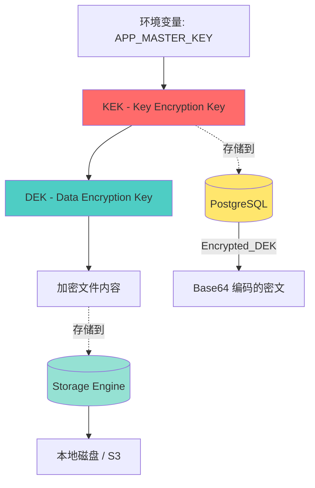
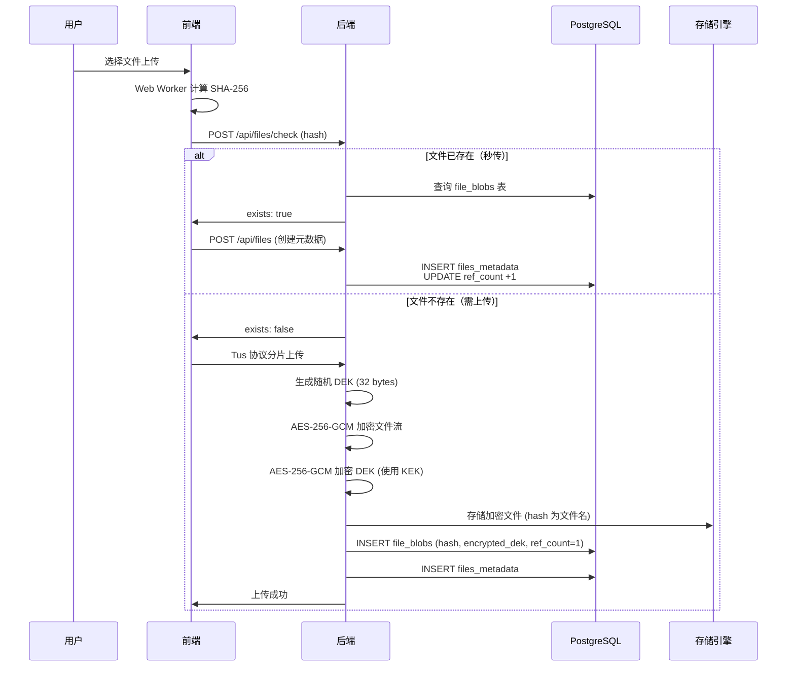
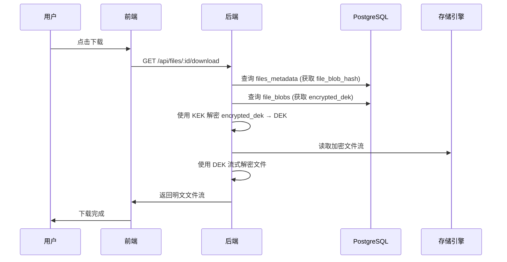

# 信封加密架构设计

**版本**: v1.0
**最后更新**: 2026-02-04
**负责人**: Claude AI
**关联模块**: server/internal/crypto

---

## 📋 目录

- [1. 设计目标](#1-设计目标)
- [2. 密钥层级架构](#2-密钥层级架构)
- [3. 加密流程](#3-加密流程)
- [4. 解密流程](#4-解密流程)
- [5. 密钥管理](#5-密钥管理)
- [6. 安全考虑](#6-安全考虑)
- [7. 实现细节](#7-实现细节)

---

## 1. 设计目标

### 1.1 核心需求

AhaVault 的加密系统需要满足以下目标：

1. **隐私保护**: 服务端无法读取用户文件内容（致盲存储）
2. **密钥隔离**: 每个文件使用独立密钥，避免单点泄露
3. **密钥轮换**: 支持 Master Key 轮换而无需重新加密所有文件
4. **性能要求**: 支持大文件流式加密/解密，避免内存溢出
5. **合规性**: 满足数据保护法规要求（如 GDPR）

### 1.2 为什么选择信封加密？

**传统方案的问题**:
```
方案 A: 单一 Master Key 直接加密所有文件
❌ 密钥泄露 → 所有历史文件全部泄露
❌ 无法轮换密钥（需重写所有文件，成本高昂）

方案 B: 每个文件随机生成密钥，明文存储到数据库
❌ 数据库泄露 → 所有文件可被解密
```

**信封加密方案**:
```
✅ Master Key 泄露 → 仅影响数据库中的加密密钥，文件本身仍安全
✅ 数据库泄露 → 没有 Master Key 无法解密密钥，文件仍安全
✅ 支持密钥轮换 → 仅需重加密数据库中的密钥字段
✅ 文件级隔离 → 单个密钥泄露仅影响单个文件
```

---

## 2. 密钥层级架构

### 2.1 两层密钥结构



### 2.2 密钥说明

#### KEK (Key Encryption Key)

- **定义**: 全局主密钥（Master Key）
- **用途**: 仅用于加密/解密 DEK
- **存储**: 通过环境变量 `APP_MASTER_KEY` 注入
- **长度**: 32 字节（256-bit）
- **格式**: HEX 字符串（64 字符）
- **生成**: `openssl rand -hex 32`

**示例**:
```bash
APP_MASTER_KEY=a1b2c3d4e5f67890abcdef1234567890a1b2c3d4e5f67890abcdef1234567890
```

#### DEK (Data Encryption Key)

- **定义**: 文件专属加密密钥
- **用途**: 加密/解密单个文件的内容
- **存储**: 加密后存储在数据库 `file_blobs.encrypted_dek` 字段
- **长度**: 32 字节（256-bit）
- **生成**: 每次文件上传时随机生成
- **特性**: 每个物理文件（hash）对应一个 DEK

---

## 3. 加密流程

### 3.1 文件上传完整流程



### 3.2 加密步骤详解

#### 步骤 1: 生成 DEK

```go
// 生成 32 字节随机 DEK
dek := make([]byte, 32)
if _, err := rand.Read(dek); err != nil {
    return err
}
```

#### 步骤 2: 使用 DEK 加密文件流

```go
// AES-256-GCM 加密
block, err := aes.NewCipher(dek)
aead, err := cipher.NewGCM(block)

// 生成随机 Nonce (12 bytes for GCM)
nonce := make([]byte, aead.NonceSize())
rand.Read(nonce)

// 流式加密文件内容
ciphertext := aead.Seal(nonce, nonce, plaintext, nil)
```

**为什么选择 GCM 模式？**
- ✅ 认证加密（AEAD），防止数据篡改
- ✅ 高性能（硬件加速支持）
- ✅ 并行处理能力强

#### 步骤 3: 使用 KEK 加密 DEK

```go
// 从环境变量获取 KEK
kek, err := hex.DecodeString(os.Getenv("APP_MASTER_KEY"))

// 使用相同的 AES-256-GCM 加密 DEK
block, err := aes.NewCipher(kek)
aead, err := cipher.NewGCM(block)

nonce := make([]byte, aead.NonceSize())
rand.Read(nonce)

encryptedDEK := aead.Seal(nonce, nonce, dek, nil)

// Base64 编码后存储到数据库
encryptedDEKStr := base64.StdEncoding.EncodeToString(encryptedDEK)
```

#### 步骤 4: 存储

```sql
-- 存储到数据库
INSERT INTO file_blobs (hash, encrypted_dek, store_path, ref_count)
VALUES (
    'aabbccdd...',
    'nonce+ciphertext (Base64)',
    '/aa/bb/aabbccdd...',
    1
);

-- 同时创建用户元数据
INSERT INTO files_metadata (user_id, file_blob_hash, filename, size)
VALUES (...);
```

### 3.3 数据格式

#### encrypted_dek 格式

```
[ Nonce (12 bytes) ][ Ciphertext (32 bytes) ][ Auth Tag (16 bytes) ]
|                   |                         |                      |
|<-- GCM Nonce ---->|<----- Encrypted DEK --->|<----- GCM Tag ----->|

总长度: 60 bytes
Base64 编码后: 80 字符
```

#### 加密文件格式

```
[ Nonce (12 bytes) ][ Ciphertext (N bytes) ][ Auth Tag (16 bytes) ]
|                   |                        |                      |
|<-- GCM Nonce ---->|<--- Encrypted Data --->|<----- GCM Tag ----->|

存储路径: /data/storage/{aa}/{bb}/{sha256_hash}
```

---

## 4. 解密流程

### 4.1 文件下载完整流程



### 4.2 解密步骤详解

#### 步骤 1: 从数据库获取 encrypted_dek

```sql
SELECT encrypted_dek
FROM file_blobs
WHERE hash = 'aabbccdd...';
```

#### 步骤 2: 解密 DEK

```go
// Base64 解码
encryptedDEK, err := base64.StdEncoding.DecodeString(encryptedDEKStr)

// 分离 Nonce 和 Ciphertext
nonce := encryptedDEK[:12]
ciphertext := encryptedDEK[12:]

// 使用 KEK 解密
kek, _ := hex.DecodeString(os.Getenv("APP_MASTER_KEY"))
block, _ := aes.NewCipher(kek)
aead, _ := cipher.NewGCM(block)

dek, err := aead.Open(nil, nonce, ciphertext, nil)
if err != nil {
    return errors.New("Failed to decrypt DEK: invalid KEK or corrupted data")
}
```

#### 步骤 3: 读取加密文件

```go
// 从存储引擎读取加密文件
encryptedFile, err := storage.Get(hash)
defer encryptedFile.Close()

// 读取整个文件到内存（小文件）
encryptedData, err := ioutil.ReadAll(encryptedFile)
```

#### 步骤 4: 解密文件流

```go
// 分离 Nonce 和 Ciphertext
nonce := encryptedData[:12]
ciphertext := encryptedData[12:]

// 使用 DEK 解密
block, _ := aes.NewCipher(dek)
aead, _ := cipher.NewGCM(block)

plaintext, err := aead.Open(nil, nonce, ciphertext, nil)
if err != nil {
    return errors.New("Decryption failed: file corrupted or tampered")
}

// 返回明文流给客户端
http.ResponseWriter.Write(plaintext)
```

### 4.3 大文件流式解密

对于大文件（如 2GB 视频），不能一次性加载到内存，需要流式处理：

```go
// 使用 cipher.StreamReader 进行流式解密
stream := cipher.NewGCMStream(block, nonce)
reader := &cipher.StreamReader{S: stream, R: encryptedFile}

// 边读边解密，直接写入 HTTP Response
io.Copy(http.ResponseWriter, reader)
```

---

## 5. 密钥管理

### 5.1 KEK 管理

#### 安全注入

```bash
# ✅ 推荐：通过环境变量注入
export APP_MASTER_KEY=$(openssl rand -hex 32)

# ✅ 推荐：Docker Compose Secrets
docker-compose.yml:
  secrets:
    - master_key

# ❌ 禁止：硬编码到代码
const masterKey = "a1b2c3d4..." // 严禁！
```

#### 密钥轮换（Key Rotation）

**场景**: 定期更换 KEK 以提升安全性

**步骤**:
```go
// 1. 生成新的 KEK
newKEK := generateNewKEK()

// 2. 批量重加密所有 DEK
for _, blob := range allFileBlobs {
    // 用旧 KEK 解密 DEK
    dek := decryptDEK(blob.EncryptedDEK, oldKEK)

    // 用新 KEK 重新加密 DEK
    newEncryptedDEK := encryptDEK(dek, newKEK)

    // 更新数据库
    updateFileBlobEncryptedDEK(blob.Hash, newEncryptedDEK)
}

// 3. 替换环境变量中的 KEK
replaceKEK(newKEK)

// 优势：物理文件无需重新加密！
```

### 5.2 DEK 管理

- **生命周期**: 与文件绑定，文件删除后 DEK 也被删除
- **存储安全**: 始终以加密形式存储，从不落地明文
- **内存安全**: 使用后立即清零

```go
// 使用后清零 DEK
defer func() {
    for i := range dek {
        dek[i] = 0
    }
}()
```

### 5.3 密钥备份与恢复

**备份策略**:
```bash
# 1. 备份 KEK（加密后存储）
echo $APP_MASTER_KEY | gpg --encrypt > master_key.gpg.backup

# 2. 异地存储（如 AWS Secrets Manager）
aws secretsmanager create-secret \
    --name ahavault-master-key \
    --secret-string $APP_MASTER_KEY
```

**灾难恢复**:
- 若 KEK 丢失 → **所有文件永久无法解密**（设计如此）
- 若数据库丢失 → 物理文件无法关联到用户，但数据完整
- 若存储丢失 → 元数据存在但文件不可恢复

---

## 6. 安全考虑

### 6.1 威胁模型

| 威胁场景 | 攻击者能力 | 系统防护 |
|---------|----------|---------|
| 数据库泄露 | 获取 encrypted_dek | ✅ 没有 KEK 无法解密 DEK |
| 存储泄露 | 获取加密文件 | ✅ 没有 DEK 无法解密文件 |
| KEK 泄露 | 获取 Master Key | ⚠️ 需同时获取数据库才能解密 |
| 内部人员 | 服务器访问权限 | ✅ 无法读取文件明文（致盲设计） |
| 中间人攻击 | 截获传输数据 | ✅ 强制 HTTPS + HSTS |

### 6.2 安全最佳实践

#### 1. KEK 保护

```bash
# ✅ 使用硬件安全模块 (HSM)
export APP_MASTER_KEY=$(vault kv get secret/ahavault/master-key)

# ✅ 定期轮换（建议每 90 天）
cron: 0 0 1 */3 * /scripts/rotate-kek.sh

# ❌ 禁止在日志中打印
logger.Debug("KEK: %s", kek) // 严禁！
```

#### 2. 加密算法选择

```go
// ✅ 使用现代加密算法
AES-256-GCM  // 认证加密，防篡改

// ❌ 避免不安全的算法
AES-ECB      // 不安全，已弃用
DES          // 密钥长度不足
```

#### 3. 随机数生成

```go
// ✅ 使用密码学安全的随机数生成器
import "crypto/rand"

nonce := make([]byte, 12)
rand.Read(nonce)

// ❌ 禁止使用 math/rand
math.rand.Read(nonce) // 不安全！
```

#### 4. 错误处理

```go
// ✅ 不泄露敏感信息
if err != nil {
    return errors.New("Decryption failed")
}

// ❌ 避免详细错误信息
return errors.New("KEK mismatch: invalid key at byte 16") // 泄露信息
```

### 6.3 合规性

- **GDPR**: 用户删除数据时，DEK 也被删除，满足"被遗忘权"
- **数据本地化**: 支持本地存储，满足数据主权要求
- **访问控制**: 管理员无法读取用户文件明文（致盲管理）

---

## 7. 实现细节

### 7.1 代码结构

```
server/internal/crypto/
├── envelope.go       # 信封加密核心逻辑
├── envelope_test.go  # 单元测试
├── hash.go           # SHA-256 哈希计算
└── stream.go         # 流式加密/解密（大文件）
```

### 7.2 核心接口

```go
package crypto

// EncryptDEK 使用 KEK 加密 DEK
func EncryptDEK(dek []byte, kek []byte) ([]byte, error)

// DecryptDEK 使用 KEK 解密 DEK
func DecryptDEK(encryptedDEK []byte, kek []byte) ([]byte, error)

// EncryptStream 使用 DEK 流式加密文件
func EncryptStream(reader io.Reader, dek []byte) (io.Reader, error)

// DecryptStream 使用 DEK 流式解密文件
func DecryptStream(reader io.Reader, dek []byte) (io.Reader, error)

// GenerateDEK 生成随机 DEK
func GenerateDEK() ([]byte, error)
```

### 7.3 性能优化

#### 1. 大文件流式处理

```go
// 避免一次性加载到内存
// ❌ 不推荐
data, _ := ioutil.ReadAll(file) // OOM 风险
encrypted := encrypt(data)

// ✅ 推荐
encryptedReader := NewEncryptedReader(file, dek)
io.Copy(response, encryptedReader) // 流式传输
```

#### 2. 并发加密

```go
// 对于多个小文件，使用 Goroutine 并发加密
var wg sync.WaitGroup
for _, file := range files {
    wg.Add(1)
    go func(f File) {
        defer wg.Done()
        encrypt(f)
    }(file)
}
wg.Wait()
```

#### 3. 硬件加速

```go
// AES-GCM 在现代 CPU 上有硬件加速（AES-NI）
// Go 标准库会自动使用，无需额外配置
```

### 7.4 测试覆盖

```go
// envelope_test.go
func TestEncryptDecryptDEK(t *testing.T) {
    kek := generateTestKEK()
    dek := generateTestDEK()

    // 加密
    encrypted, err := EncryptDEK(dek, kek)
    assert.NoError(t, err)

    // 解密
    decrypted, err := DecryptDEK(encrypted, kek)
    assert.NoError(t, err)
    assert.Equal(t, dek, decrypted)
}

func TestInvalidKEK(t *testing.T) {
    encrypted := []byte("fake data")
    wrongKEK := []byte("wrong key")

    _, err := DecryptDEK(encrypted, wrongKEK)
    assert.Error(t, err)
}
```

---

## 📚 参考资料

- [AWS: Envelope Encryption](https://docs.aws.amazon.com/kms/latest/developerguide/concepts.html#enveloping)
- [Google Cloud: Encryption at Rest](https://cloud.google.com/security/encryption/default-encryption)
- [NIST: AES-GCM Specification](https://nvlpubs.nist.gov/nistpubs/Legacy/SP/nistspecialpublication800-38d.pdf)

---

**文档维护**: 本文档应与 `server/internal/crypto` 实现保持同步。

**最后审核**: 2026-02-04
