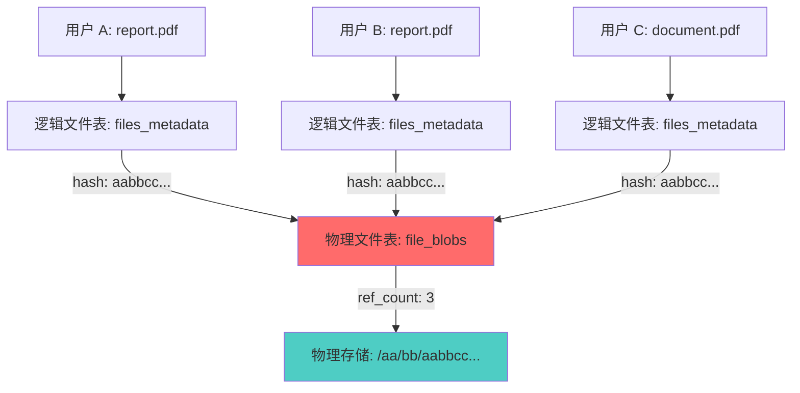
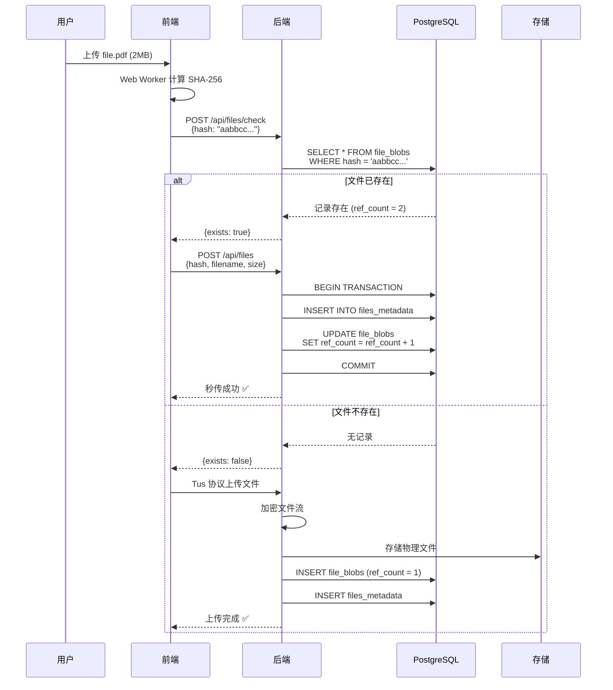
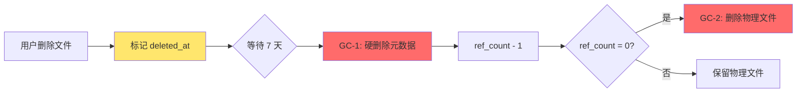

# CAS 存储引擎架构设计

**版本**: v1.0
**最后更新**: 2026-02-04
**负责人**: Claude AI
**关联模块**: server/internal/storage

---

## 📋 目录

- [1. 设计概述](#1-设计概述)
- [2. 内容寻址存储原理](#2-内容寻址存储原理)
- [3. 去重机制](#3-去重机制)
- [4. 引用计数管理](#4-引用计数管理)
- [5. 存储引擎接口](#5-存储引擎接口)
- [6. 目录结构设计](#6-目录结构设计)
- [7. 垃圾回收策略](#7-垃圾回收策略)
- [8. 性能优化](#8-性能优化)

---

## 1. 设计概述

### 1.1 什么是 CAS？

**CAS (Content-Addressable Storage)** 是一种通过内容本身（而非位置）来寻址的存储方式。文件的唯一标识符是其内容的哈希值（SHA-256），而非传统的文件路径。

### 1.2 设计目标

1. **全局去重**: 相同内容的文件在物理层仅存储一份
2. **空间高效**: 大幅降低存储成本，尤其在大量重复文件场景
3. **数据完整性**: 通过哈希验证确保文件未被篡改
4. **安全隔离**: 用户看到的逻辑文件相互独立，物理层共享存储

### 1.3 架构总览



**说明**: 三个用户上传了相同内容的 PDF 文件，物理层仅存储一份，通过引用计数维护关系。

---

## 2. 内容寻址存储原理

### 2.1 哈希计算

使用 **SHA-256** 算法计算文件内容的唯一标识：

```
文件内容 → SHA-256 → aabbccddeeff1122334455667788990011223344556677889900aabbccddeeff
```

**特性**:
- **唯一性**: 两个不同内容的文件几乎不可能产生相同哈希（碰撞概率 < 2^-256）
- **确定性**: 相同内容总是产生相同哈希
- **单向性**: 无法从哈希反推原始内容

### 2.2 前端哈希计算

为了支持秒传，前端需要在上传前计算文件哈希：

```javascript
// web/src/workers/sha256.worker.ts
import CryptoJS from 'crypto-js';

self.onmessage = async (e) => {
  const file = e.data.file;
  const chunkSize = 2 * 1024 * 1024; // 2MB per chunk
  const chunks = Math.ceil(file.size / chunkSize);

  const hasher = CryptoJS.algo.SHA256.create();

  for (let i = 0; i < chunks; i++) {
    const start = i * chunkSize;
    const end = Math.min(start + chunkSize, file.size);
    const chunk = file.slice(start, end);

    const arrayBuffer = await chunk.arrayBuffer();
    const wordArray = CryptoJS.lib.WordArray.create(arrayBuffer);

    hasher.update(wordArray);

    // 报告进度
    self.postMessage({
      type: 'progress',
      progress: ((i + 1) / chunks) * 100
    });
  }

  const hash = hasher.finalize().toString();

  self.postMessage({
    type: 'complete',
    hash: hash
  });
};
```

**为什么在前端计算？**
- ✅ 支持秒传（上传前检测）
- ✅ 减少服务器计算负担
- ✅ 提前验证文件完整性

### 2.3 后端哈希验证

后端在接收文件时需要重新计算哈希验证：

```go
// server/internal/crypto/hash.go
func CalculateSHA256(reader io.Reader) (string, error) {
    hasher := sha256.New()
    if _, err := io.Copy(hasher, reader); err != nil {
        return "", err
    }
    return hex.EncodeToString(hasher.Sum(nil)), nil
}
```

**双重验证流程**:
```
前端计算 hash → 后端接收 → 后端重新计算 → 比对一致 → 存储
```

---

## 3. 去重机制

### 3.1 去重流程



### 3.2 秒传优势

**场景**: 公司内 100 人都需要下载同一份 500MB 的安装包

**传统方案**:
- 100 人各上传一次 → 总上传流量 = 50GB
- 存储空间占用 = 50GB

**CAS 方案**:
- 第 1 人上传 500MB，后续 99 人秒传（0 流量）
- 存储空间占用 = 500MB
- **节省**: 99% 流量 + 99% 存储

---

## 4. 引用计数管理

### 4.1 为什么需要引用计数？

```
物理文件: /storage/aa/bb/aabbcc...
    ↑
    |--- 用户 A 的 report.pdf (逻辑文件)
    |--- 用户 B 的 backup.pdf (逻辑文件)
    |--- 用户 C 的 doc.pdf     (逻辑文件)

引用计数 = 3
```

**问题**: 当用户 A 删除文件时，是否应该删除物理文件？

**答案**: 不应该！因为用户 B 和 C 还在引用。只有当 `ref_count = 0` 时才能删除。

### 4.2 数据库表结构

#### file_blobs (物理文件表)

```sql
CREATE TABLE file_blobs (
    hash VARCHAR(64) PRIMARY KEY,              -- SHA-256 哈希值
    store_path VARCHAR(255) NOT NULL,          -- 物理存储路径
    encrypted_dek TEXT NOT NULL,               -- 加密后的 DEK
    size BIGINT NOT NULL,                      -- 文件大小 (bytes)
    mime_type VARCHAR(128),                    -- MIME 类型
    ref_count INT NOT NULL DEFAULT 1,          -- 引用计数 ⭐
    is_banned BOOLEAN DEFAULT FALSE,           -- 是否被管理员禁止
    created_at TIMESTAMP DEFAULT NOW(),
    updated_at TIMESTAMP DEFAULT NOW()
);

CREATE INDEX idx_ref_count ON file_blobs(ref_count);
```

#### files_metadata (逻辑文件表)

```sql
CREATE TABLE files_metadata (
    id UUID PRIMARY KEY DEFAULT gen_random_uuid(),
    user_id UUID NOT NULL REFERENCES users(id),
    file_blob_hash VARCHAR(64) REFERENCES file_blobs(hash) ON DELETE RESTRICT,
    filename VARCHAR(255) NOT NULL,            -- 用户自定义文件名
    size BIGINT NOT NULL,
    created_at TIMESTAMP DEFAULT NOW(),
    expires_at TIMESTAMP,                      -- 文件过期时间
    deleted_at TIMESTAMP,                      -- 软删除时间 ⭐

    FOREIGN KEY (file_blob_hash) REFERENCES file_blobs(hash)
);

CREATE INDEX idx_user_files ON files_metadata(user_id, deleted_at);
CREATE INDEX idx_blob_hash ON files_metadata(file_blob_hash);
```

### 4.3 引用计数操作（关键！）

#### 4.3.1 用户上传文件

```sql
-- 方案 A: 文件已存在（秒传）
BEGIN;
    INSERT INTO files_metadata (user_id, file_blob_hash, filename, size)
    VALUES ('user-uuid', 'aabbcc...', 'my_file.pdf', 2048576);

    UPDATE file_blobs
    SET ref_count = ref_count + 1,
        updated_at = NOW()
    WHERE hash = 'aabbcc...';
COMMIT;

-- 方案 B: 文件不存在（首次上传）
BEGIN;
    INSERT INTO file_blobs (hash, store_path, encrypted_dek, size, ref_count)
    VALUES ('aabbcc...', '/aa/bb/aabbcc...', 'encrypted_dek_data', 2048576, 1);

    INSERT INTO files_metadata (user_id, file_blob_hash, filename, size)
    VALUES ('user-uuid', 'aabbcc...', 'my_file.pdf', 2048576);
COMMIT;
```

#### 4.3.2 用户删除文件（软删除）

```sql
BEGIN;
    -- 标记逻辑文件为已删除
    UPDATE files_metadata
    SET deleted_at = NOW()
    WHERE id = 'file-uuid' AND user_id = 'user-uuid';

    -- 减少引用计数
    UPDATE file_blobs
    SET ref_count = ref_count - 1,
        updated_at = NOW()
    WHERE hash = (
        SELECT file_blob_hash FROM files_metadata WHERE id = 'file-uuid'
    );
COMMIT;
```

#### 4.3.3 后台 GC 硬删除

```sql
-- 1. 删除软删除超过 7 天的元数据
BEGIN;
    DELETE FROM files_metadata
    WHERE deleted_at IS NOT NULL
      AND deleted_at < NOW() - INTERVAL '7 days';
COMMIT;

-- 2. 清理引用计数为 0 的物理文件
BEGIN;
    -- 获取所有 ref_count = 0 的文件
    SELECT hash, store_path
    FROM file_blobs
    WHERE ref_count = 0;

    -- 从物理存储删除文件
    -- (在应用层调用 storage.Delete(hash))

    -- 从数据库删除记录
    DELETE FROM file_blobs WHERE ref_count = 0;
COMMIT;
```

### 4.4 数据一致性保证

**关键原则**: 引用计数的增减**必须在数据库事务中完成**，严禁应用层计算。

#### ❌ 错误示例（竞态条件）

```go
// 错误：应用层计算 ref_count
currentCount := getRefCount(hash)
newCount := currentCount + 1
updateRefCount(hash, newCount)  // 竞态条件！两个并发请求可能导致计数错误
```

#### ✅ 正确示例（数据库原子操作）

```go
// 正确：使用数据库原子操作
tx := db.Begin()
defer tx.Rollback()

// 创建逻辑文件
if err := tx.Create(&metadata).Error; err != nil {
    return err
}

// 原子地增加引用计数
if err := tx.Exec("UPDATE file_blobs SET ref_count = ref_count + 1 WHERE hash = ?", hash).Error; err != nil {
    return err
}

tx.Commit()
```

### 4.5 引用计数一致性检查

定期运行一致性检查脚本，确保 `ref_count` 准确：

```sql
-- 检查不一致的记录
SELECT
    b.hash,
    b.ref_count AS stored_count,
    COUNT(m.id) AS actual_count
FROM file_blobs b
LEFT JOIN files_metadata m ON m.file_blob_hash = b.hash AND m.deleted_at IS NULL
GROUP BY b.hash
HAVING b.ref_count != COUNT(m.id);

-- 修复引用计数
UPDATE file_blobs b
SET ref_count = (
    SELECT COUNT(*)
    FROM files_metadata m
    WHERE m.file_blob_hash = b.hash AND m.deleted_at IS NULL
)
WHERE hash IN (
    SELECT hash FROM file_blobs WHERE ref_count != (
        SELECT COUNT(*) FROM files_metadata WHERE file_blob_hash = hash AND deleted_at IS NULL
    )
);
```

---

## 5. 存储引擎接口

### 5.1 接口设计

```go
// server/internal/storage/interface.go
package storage

import "io"

// Engine 定义存储引擎接口
type Engine interface {
    // Put 存储文件，返回存储路径
    Put(hash string, reader io.Reader) error

    // Get 读取文件，返回可读流
    Get(hash string) (io.ReadCloser, error)

    // Delete 删除文件
    Delete(hash string) error

    // Exists 检查文件是否存在
    Exists(hash string) (bool, error)

    // Stat 获取文件信息
    Stat(hash string) (*FileInfo, error)
}

type FileInfo struct {
    Hash      string
    Size      int64
    StorePath string
}
```

### 5.2 Local 存储实现

```go
// server/internal/storage/local.go
package storage

import (
    "io"
    "os"
    "path/filepath"
)

type LocalEngine struct {
    basePath string // 如 /data/storage
}

func NewLocalEngine(basePath string) *LocalEngine {
    return &LocalEngine{basePath: basePath}
}

func (e *LocalEngine) Put(hash string, reader io.Reader) error {
    // 生成路径: /data/storage/aa/bb/aabbcc...
    path := e.generatePath(hash)

    // 确保目录存在
    if err := os.MkdirAll(filepath.Dir(path), 0755); err != nil {
        return err
    }

    // 创建文件
    file, err := os.Create(path)
    if err != nil {
        return err
    }
    defer file.Close()

    // 写入数据
    _, err = io.Copy(file, reader)
    return err
}

func (e *LocalEngine) Get(hash string) (io.ReadCloser, error) {
    path := e.generatePath(hash)
    return os.Open(path)
}

func (e *LocalEngine) Delete(hash string) error {
    path := e.generatePath(hash)
    return os.Remove(path)
}

func (e *LocalEngine) Exists(hash string) (bool, error) {
    path := e.generatePath(hash)
    _, err := os.Stat(path)
    if os.IsNotExist(err) {
        return false, nil
    }
    return err == nil, err
}

func (e *LocalEngine) generatePath(hash string) string {
    // hash = aabbccddeeff...
    // path = /data/storage/aa/bb/aabbccddeeff...
    return filepath.Join(e.basePath, hash[:2], hash[2:4], hash)
}
```

### 5.3 S3 存储实现

```go
// server/internal/storage/s3.go
package storage

import (
    "io"
    "github.com/aws/aws-sdk-go/aws"
    "github.com/aws/aws-sdk-go/service/s3"
)

type S3Engine struct {
    client *s3.S3
    bucket string
}

func NewS3Engine(endpoint, region, accessKey, secretKey, bucket string) *S3Engine {
    // 初始化 S3 客户端
    sess := session.Must(session.NewSession(&aws.Config{
        Endpoint:         aws.String(endpoint),
        Region:           aws.String(region),
        Credentials:      credentials.NewStaticCredentials(accessKey, secretKey, ""),
        S3ForcePathStyle: aws.Bool(true),
    }))

    return &S3Engine{
        client: s3.New(sess),
        bucket: bucket,
    }
}

func (e *S3Engine) Put(hash string, reader io.Reader) error {
    key := e.generateKey(hash)

    _, err := e.client.PutObject(&s3.PutObjectInput{
        Bucket: aws.String(e.bucket),
        Key:    aws.String(key),
        Body:   reader,
    })
    return err
}

func (e *S3Engine) Get(hash string) (io.ReadCloser, error) {
    key := e.generateKey(hash)

    result, err := e.client.GetObject(&s3.GetObjectInput{
        Bucket: aws.String(e.bucket),
        Key:    aws.String(key),
    })
    if err != nil {
        return nil, err
    }

    return result.Body, nil
}

func (e *S3Engine) Delete(hash string) error {
    key := e.generateKey(hash)

    _, err := e.client.DeleteObject(&s3.DeleteObjectInput{
        Bucket: aws.String(e.bucket),
        Key:    aws.String(key),
    })
    return err
}

func (e *S3Engine) Exists(hash string) (bool, error) {
    key := e.generateKey(hash)

    _, err := e.client.HeadObject(&s3.HeadObjectInput{
        Bucket: aws.String(e.bucket),
        Key:    aws.String(key),
    })

    if err != nil {
        if aerr, ok := err.(awserr.Error); ok && aerr.Code() == s3.ErrCodeNoSuchKey {
            return false, nil
        }
        return false, err
    }

    return true, nil
}

func (e *S3Engine) generateKey(hash string) string {
    // key = aa/bb/aabbccddeeff...
    return fmt.Sprintf("%s/%s/%s", hash[:2], hash[2:4], hash)
}
```

### 5.4 配置与初始化

```go
// server/internal/config/storage.go
func InitStorageEngine(cfg *Config) storage.Engine {
    switch cfg.StorageType {
    case "local":
        return storage.NewLocalEngine(cfg.StoragePath)

    case "s3":
        return storage.NewS3Engine(
            cfg.S3Endpoint,
            cfg.S3Region,
            cfg.S3AccessKey,
            cfg.S3SecretKey,
            cfg.S3Bucket,
        )

    default:
        log.Fatalf("Unknown storage type: %s", cfg.StorageType)
        return nil
    }
}
```

---

## 6. 目录结构设计

### 6.1 为什么使用 2 级哈希分片？

**问题**: 如果将所有文件存储在单一目录：

```
/data/storage/
├── aabbccddeeff11223344...
├── 112233445566778899aa...
├── 223344556677889900bb...
└── ... (数百万个文件)
```

**性能问题**:
- ❌ 单目录文件数过多，文件系统性能下降（ext4 单目录最优 < 10,000 文件）
- ❌ `ls` 命令执行缓慢
- ❌ 文件查找效率低

**解决方案**: 使用哈希前缀进行分片

```
/data/storage/
├── aa/
│   ├── bb/
│   │   ├── aabbccddeeff11223344...
│   │   └── aabb11223344556677...
│   └── cc/
│       └── aacc99887766554433...
├── ab/
│   └── cd/
│       └── abcd...
└── ...
```

### 6.2 分片策略

```
hash = aabbccddeeff1122334455667788990011223344556677889900aabbccddeeff
        ↓    ↓
       aa   bb

目录结构 = /data/storage/aa/bb/aabbccddeeff...
```

**分片效果**:
- 第 1 级目录: 256 个 (00-FF)
- 第 2 级目录: 256 个 (00-FF)
- **总分片数**: 256 × 256 = 65,536 个目录

**优势**:
- ✅ 即使有 1000 万个文件，每个目录平均仅 ~150 个文件
- ✅ 文件系统性能保持最优
- ✅ 支持水平扩展（按目录分片到不同磁盘）

### 6.3 路径生成示例

```go
func generateStoragePath(hash string) string {
    // hash = "a1b2c3d4e5f6..."
    // return "/data/storage/a1/b2/a1b2c3d4e5f6..."

    if len(hash) < 4 {
        return ""
    }

    return filepath.Join(
        "/data/storage",
        hash[:2],    // 第 1 级: a1
        hash[2:4],   // 第 2 级: b2
        hash,        // 完整哈希作为文件名
    )
}
```

---

## 7. 垃圾回收策略

### 7.1 三阶段 GC 设计



### 7.2 GC 任务实现

#### GC-1: 元数据清理（每日凌晨 2:00）

```go
// server/internal/tasks/gc.go
func CleanupSoftDeletedMetadata() error {
    log.Info("Starting GC: Cleanup soft-deleted metadata")

    tx := db.Begin()
    defer tx.Rollback()

    // 查询软删除超过 7 天的记录
    var toDelete []FilesMetadata
    if err := tx.Where("deleted_at < ?", time.Now().Add(-7*24*time.Hour)).
        Find(&toDelete).Error; err != nil {
        return err
    }

    // 批量减少引用计数
    for _, metadata := range toDelete {
        if err := tx.Exec("UPDATE file_blobs SET ref_count = ref_count - 1 WHERE hash = ?",
            metadata.FileBlobHash).Error; err != nil {
            return err
        }
    }

    // 删除元数据记录
    if err := tx.Where("deleted_at < ?", time.Now().Add(-7*24*time.Hour)).
        Delete(&FilesMetadata{}).Error; err != nil {
        return err
    }

    tx.Commit()

    log.Infof("GC: Cleaned up %d metadata records", len(toDelete))
    return nil
}
```

#### GC-2: 孤儿文件清理（每日凌晨 3:00）

```go
func CleanupOrphanFiles(storage storage.Engine) error {
    log.Info("Starting GC: Cleanup orphan files")

    tx := db.Begin()
    defer tx.Rollback()

    // 查询引用计数为 0 的文件
    var orphans []FileBlob
    if err := tx.Where("ref_count = 0").Find(&orphans).Error; err != nil {
        return err
    }

    deletedCount := 0
    for _, blob := range orphans {
        // 从物理存储删除
        if err := storage.Delete(blob.Hash); err != nil {
            log.Errorf("Failed to delete file %s: %v", blob.Hash, err)
            continue
        }

        // 从数据库删除
        if err := tx.Delete(&blob).Error; err != nil {
            log.Errorf("Failed to delete blob record %s: %v", blob.Hash, err)
            continue
        }

        deletedCount++
    }

    tx.Commit()

    log.Infof("GC: Cleaned up %d orphan files", deletedCount)
    return nil
}
```

#### GC-3: 碎片清理（每小时）

```go
func CleanupUploadFragments(storage storage.Engine) error {
    log.Info("Starting GC: Cleanup upload fragments")

    // 查询上传中断的临时文件（状态为 uploading 且超过 24 小时）
    var fragments []UploadSession
    if err := db.Where("status = ? AND updated_at < ?", "uploading",
        time.Now().Add(-24*time.Hour)).Find(&fragments).Error; err != nil {
        return err
    }

    deletedCount := 0
    for _, session := range fragments {
        // 删除临时文件
        if err := storage.Delete(session.TempHash); err != nil {
            log.Errorf("Failed to delete fragment %s: %v", session.TempHash, err)
            continue
        }

        // 删除会话记录
        db.Delete(&session)
        deletedCount++
    }

    log.Infof("GC: Cleaned up %d upload fragments", deletedCount)
    return nil
}
```

### 7.3 定时任务调度

```go
// server/cmd/server/main.go
func startGarbageCollector(storage storage.Engine) {
    // GC-1: 每日凌晨 2:00 清理元数据
    gocron.Every(1).Day().At("02:00").Do(func() {
        if err := tasks.CleanupSoftDeletedMetadata(); err != nil {
            log.Errorf("GC-1 failed: %v", err)
        }
    })

    // GC-2: 每日凌晨 3:00 清理孤儿文件
    gocron.Every(1).Day().At("03:00").Do(func() {
        if err := tasks.CleanupOrphanFiles(storage); err != nil {
            log.Errorf("GC-2 failed: %v", err)
        }
    })

    // GC-3: 每小时清理上传碎片
    gocron.Every(1).Hour().Do(func() {
        if err := tasks.CleanupUploadFragments(storage); err != nil {
            log.Errorf("GC-3 failed: %v", err)
        }
    })

    gocron.Start()
}
```

---

## 8. 性能优化

### 8.1 数据库索引

```sql
-- 加速引用计数查询
CREATE INDEX idx_ref_count ON file_blobs(ref_count);

-- 加速用户文件查询
CREATE INDEX idx_user_files ON files_metadata(user_id, deleted_at);

-- 加速哈希查找
CREATE INDEX idx_blob_hash ON files_metadata(file_blob_hash);

-- 加速 GC 查询
CREATE INDEX idx_deleted_at ON files_metadata(deleted_at) WHERE deleted_at IS NOT NULL;
```

### 8.2 并发控制

#### 上传锁（Redis 分布式锁）

```go
// 防止并发上传同一文件导致重复存储
func acquireUploadLock(hash string) (bool, error) {
    key := fmt.Sprintf("upload_lock:%s", hash)
    success, err := redis.SetNX(key, "locked", 10*time.Minute).Result()
    return success, err
}

func releaseUploadLock(hash string) error {
    key := fmt.Sprintf("upload_lock:%s", hash)
    return redis.Del(key).Err()
}
```

### 8.3 缓存策略

#### 热点文件缓存

```go
// 使用 Redis 缓存高频访问的文件元数据
func getFileBlobWithCache(hash string) (*FileBlob, error) {
    cacheKey := fmt.Sprintf("blob:%s", hash)

    // 尝试从缓存读取
    if cached, err := redis.Get(cacheKey).Result(); err == nil {
        var blob FileBlob
        json.Unmarshal([]byte(cached), &blob)
        return &blob, nil
    }

    // 缓存未命中，从数据库查询
    var blob FileBlob
    if err := db.Where("hash = ?", hash).First(&blob).Error; err != nil {
        return nil, err
    }

    // 写入缓存 (TTL 1 小时)
    data, _ := json.Marshal(blob)
    redis.Set(cacheKey, data, 1*time.Hour)

    return &blob, nil
}
```

### 8.4 批量操作优化

```go
// 批量删除文件（避免 N+1 查询）
func batchDeleteFiles(fileIDs []string) error {
    tx := db.Begin()
    defer tx.Rollback()

    // 查询所有文件的哈希值
    var metadata []FilesMetadata
    if err := tx.Where("id IN ?", fileIDs).Find(&metadata).Error; err != nil {
        return err
    }

    // 构建哈希列表
    hashes := make([]string, len(metadata))
    for i, m := range metadata {
        hashes[i] = m.FileBlobHash
    }

    // 批量软删除
    if err := tx.Model(&FilesMetadata{}).
        Where("id IN ?", fileIDs).
        Update("deleted_at", time.Now()).Error; err != nil {
        return err
    }

    // 批量减少引用计数
    for _, hash := range hashes {
        tx.Exec("UPDATE file_blobs SET ref_count = ref_count - 1 WHERE hash = ?", hash)
    }

    tx.Commit()
    return nil
}
```

---

## 📚 参考资料

- [Git: Content-Addressable Filesystem](https://git-scm.com/book/en/v2/Git-Internals-Git-Objects)
- [Restic: Design Principles](https://restic.readthedocs.io/en/latest/100_references.html#design)
- [Deduplication in Storage Systems](https://www.usenix.org/legacy/event/fast08/tech/full_papers/zhu/zhu.pdf)

---

**文档维护**: 本文档应与 `server/internal/storage` 实现保持同步。

**最后审核**: 2026-02-04
