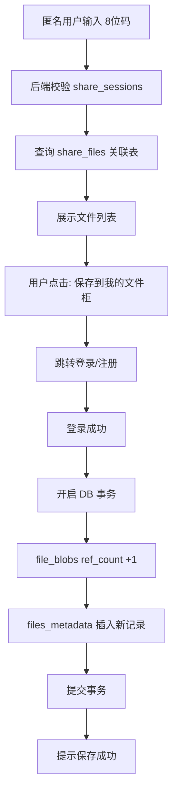

# AhaVault - 安全文件分享系统 - 软件需求规格说明书 (SRS)

**文档版本**: v1.2
**状态**: 正式定稿
**最后更新**: 2026-02-04
**适用范围**: 后端开发、前端开发、运维部署、测试

---

## 1. 引言 (Introduction)

### 1.1 项目背景
本项目旨在构建一个**私有化、轻量级、极致安全**的 Web 文件分享系统。系统采用“文件柜”与“取件码”的核心概念，摒弃传统网盘复杂的社交与目录结构，专注于文件在不同设备、不同人员之间的高效、隐私交换。系统需支持 Docker 容器化部署，适配 S3 与本地存储，并满足国内网络环境下的合规性与管理需求。

### 1.2 核心理念
1.  **安全 (Security)**: 全链路加密传输，采用**信封加密 (Envelope Encryption)** 架构，隐私优先。
2.  **简约 (Simplicity)**: 极简 UI，无广告，无冗余功能，即用即走。
3.  **高效 (Efficiency)**: 基于内容的去重（秒传），断点续传，Web Worker 高性能哈希计算。
4.  **可控 (Control)**: 管理员拥有最高权限（致盲管理），完善的日志与资源监控。

---

## 2. 系统架构 (System Architecture)

### 2.1 技术栈选型
*   **前端 (Frontend)**:
    *   框架: React 18+ (Strict Mode)
    *   语言: TypeScript
    *   UI 库: TailwindCSS (支持深色/浅色主题切换)
    *   网络库: Axios + Tus-JS-Client (断点续传)
    *   **多线程**: Web Worker (用于大文件 SHA-256 计算，避免阻塞 UI)
    *   验证组件: Cloudflare Turnstile 或 hCaptcha
*   **后端 (Backend)**:
    *   语言: Go (Golang)
    *   框架: Gin 或 Echo (高性能 Web 框架)
    *   协议: HTTP/2, Tus Protocol (用于大文件上传)
*   **数据存储 (Data Layer)**:
    *   **PostgreSQL**: 存储业务元数据（用户、文件逻辑信息、分享记录）。
    *   **Redis**: 存储热数据（Session、验证码状态）、高频计数器（限流）、上传分片锁。
*   **基础设施 (Infrastructure)**:
    *   部署: Docker & Docker Compose。
    *   反向代理: Nginx (处理 SSL 终结、静态资源缓存)。

### 2.2 存储引擎设计 (Storage Engine)
采用类 **Restic/Git** 的 **内容寻址存储 (CAS)** 架构，并结合 **信封加密**：
1.  **物理层**:
    *   支持驱动: Local Filesystem (Docker Volume) 或 S3 (AWS/Aliyun/MinIO)。
    *   目录结构: 采用 2 级哈希分片，例如 `/data/storage/{aa}/{bb}/{sha256_hash}`。
    *   文件名: 仅保留文件的 SHA-256 哈希值，无后缀，无原始文件名。
2.  **加密层 (Envelope Encryption)**:
    *   **KEK (Key Encryption Key)**: 全局 Master Key，通过环境变量注入，用于加密 DEK。
    *   **DEK (Data Encryption Key)**: 每个文件上传时随机生成独立的 AES-256 密钥。
    *   **流程**:
        *   写入: 生成随机 DEK -> 用 DEK 加密文件流 -> 用 KEK 加密 DEK -> 存储 `Encrypted_DEK` 到数据库 -> 存储密文到物理层。
        *   读取: 读取 `Encrypted_DEK` -> 用 KEK 解密得到 DEK -> 用 DEK 解密文件流。
3.  **去重逻辑**:
    *   基于 Hash 值进行全局去重。
    *   **引用计数 (Reference Counting)**: 数据库记录每个物理 Hash 被多少个逻辑文件引用。
    *   **一致性保证**: 必须使用数据库 **事务 (Transaction)** 来处理引用计数的增减，严禁应用层计算。

---

## 3. 功能需求详解 (Functional Requirements)

### 3.1 公共端 (Public/Guest)

#### 3.1.1 首页与取件
*   **界面**: 屏幕中央为大字号输入框（8位），下方为“进入文件柜/登录”入口。
*   **取件码逻辑**:
    *   格式: 8位字符，由 **数字 + 大写英文** 组成。
    *   过滤: 排除易混淆字符（`0`, `O`, `1`, `I`）。
    *   输入遮罩: 默认显示为 `*`，支持点击“眼睛”图标显示明文（防窥）。
*   **安全验证**:
    *   当同一 IP 在 1 分钟内错误尝试超过 5 次，或全局取件请求激增时，强制弹出真人验证 (Captcha)。
*   **取件结果**:
    *   **成功**: 跳转至文件列表页。
    *   **失败**: 提示“提取码不存在或已失效” (不区分具体原因，防止嗅探)。
    *   **需二级密码**: 若分享者设置了访问密码，需二次输入。

#### 3.1.2 文件列表与下载
*   **列表展示**: 显示分享包内的所有文件（文件名、大小、类型图标）。
*   **安全隐私提示**: 界面显著位置提示“文件经服务端透明加密存储，未进行内容扫描，下载后请自行查杀病毒”。
*   **下载行为**:
    *   支持“单文件下载”和“打包下载”（后端流式打包为 ZIP）。
    *   浏览器端通过 HTTPS 接收解密后的流。
*   **转存功能 (Save to Cabinet)**:
    *   按钮: “保存到我的文件柜”。
    *   逻辑: 匿名用户点击 -> 弹出登录/注册框 -> 登录成功 -> 后端执行“逻辑复制”（事务内增加引用计数，在用户目录下创建新记录） -> 提示“保存成功”。

### 3.2 用户端 (User Dashboard)

#### 3.2.1 我的文件柜
*   **视图**: 扁平化列表，无多级文件夹。
*   **元数据列**: 文件名、大小、上传时间、状态（正常/已分享）、过期时间。
*   **操作**:
    *   **上传**: 支持拖拽上传。
        *   *预检查*: 前端使用 **Web Worker** 计算 Hash -> 询问后端是否存在。
        *   *文件头校验*: 
            1. **前端**: 仅校验扩展名与内容 Magic Bytes 是否匹配，拦截低级错误。
            2. **后端**: 在接收第一个分片时，强制读取头部字节进行 **Magic Bytes** 二次校验，防止绕过。
        *   *秒传*: 若后端返回存在，直接完成。
        *   *续传*: 若不存在，使用 Tus 协议分片上传。
        *   *并发*: 支持多文件同时上传队列。
    *   **管理**: 重命名（仅修改数据库字段）、删除（逻辑删除，进入回收倒计时）、批量选择。
    *   **搜索/筛选**: 按文件名搜索，按图片/文档类型筛选。

#### 3.2.2 分享管理 (核心业务)
*   **创建分享**:
    *   用户勾选 N 个文件 -> 点击“生成分享”。
    *   **配置弹窗**:
        *   **有效期**: 1小时 / 24小时 / 7天 / 自定义 (上限受限于文件本身的生命周期)。
        *   **可用次数**: 1次 (阅后即焚) / 5次 / 10次 / 不限。
        *   **访问密码**: 选填 (二级防护)。
    *   **结果**: 系统生成唯一的 8 位取件码，并提供“复制链接”和“复制文本”按钮。
*   **我的分享**:
    *   列表展示当前生效的分享码。
    *   展示数据: 已被提取次数 / 总次数，剩余时间。
    *   操作: 提前停止分享 (Kill Link)。

### 3.3 管理员端 (Admin Panel)

#### 3.3.1 仪表盘 (Dashboard)
*   **实时图表**: CPU 使用率、内存占用、出网/入网带宽流速。
*   **存储监控**: 物理磁盘/S3 存储总量，剩余空间，预警提示。
*   **业务指标**: 今日上传文件数、今日取件次数、活跃用户数。

#### 3.3.2 全局文件管理 (致盲管控)
*   **列表**: 分页展示所有上传的文件（即使是加密的）。
*   **可见信息**: 逻辑文件名 (数据库解密后)、Owner ID、文件 Hash、大小、上传时间。
*   **管控操作**:
    *   **禁止分享**: 标记该文件 Hash 为“违规”，禁止生成新的分享码，已有分享码失效。
    *   **物理删除**: 强制从磁盘删除文件实体，并级联删除所有用户的引用记录（慎用）。
*   **举报处理**: 查看用户举报的取件码记录，进行封禁处理。

#### 3.3.3 系统设置
*   **注册开关**: 开启/关闭/仅邀请（需输入邀请码）。
*   **存储策略**: 切换 Local/S3，配置 S3 Endpoint/Key。
*   **安全策略**: 配置 IP 黑名单，配置上传类型白名单 (MIME Types)，单文件大小限制 (如 2GB)。

### 3.4 后台任务 (Background Jobs)
1.  **垃圾回收 (GC) - 碎片清理**:
    *   频率: 每小时。
    *   对象: 状态为“上传中”且最后更新时间 > 24小时的临时文件。
    *   动作: 物理删除。
2.  **垃圾回收 (GC) - 逻辑删除元数据清理**: **[新增]**
    *   频率: 每日凌晨。
    *   对象: `files_metadata` 中 `deleted_at` 不为空且超过 7 天的记录。
    *   动作: 硬删除元数据记录，触发级联引用计数减少 (DB Transaction)。
3.  **垃圾回收 (GC) - 孤儿文件清理**:
    *   频率: 每日凌晨（在元数据清理后执行）。
    *   对象: 引用计数 (`ref_count`) 为 0 的物理 Hash 文件。
    *   应用: 仅当文件确实没有被任何 `files_metadata` 引用时才删除。
4.  **生命周期检查**:
    *   频率: 每分钟。
    *   对象: 到期的分享链接、到期的用户文件。
    *   动作: 更新状态为“已过期”，或设置 `deleted_at` 触发软删除。

---

## 4. 数据库模式概览 (Database Schema Concept)

为确保理解一致，以下为核心实体关系描述：

1.  **`users`**: 用户基础信息 (ID, Email, HashPassword, Status, Role).
2.  **`files_metadata` (逻辑文件表)**:
    *   `id`: UUID
    *   `user_id`: 外键 -> users
    *   `file_blob_hash`: 外键 -> file_blobs (物理关联)
    *   `filename`: 加密存储的文件名
    *   `size`: 文件大小
    *   `created_at`: 上传时间
    *   `expires_at`: 文件自身过期时间
    *   `deleted_at`: **[新增]** 逻辑删除时间 (软删除支持)
3.  **`file_blobs` (物理文件表)**:
    *   `hash`: SHA-256 (主键)
    *   `store_path`: 物理路径 (如 `/aa/bb/hash`)
    *   `encrypted_dek`: **[新增]** AES-256 加密后的 DEK (Base64)
    *   `ref_count`: 引用计数 (Integer, 必须严格事务维护)
    *   `mime_type`: 文件类型
    *   `is_banned`: Boolean (合规标记)
4.  **`share_sessions` (分享记录表)**:
    *   `id`: UUID (主键)
    *   `pickup_code`: 8位码 (唯一索引)
    *   `creator_id`: 外键 -> users
    *   `max_downloads`: 最大次数
    *   `current_downloads`: 当前次数
    *   `expires_at`: 分享过期时间
    *   *注: 移除了 file_ids JSON 字段*
5.  **`share_files` (分享-文件关联表)**: **[新增]**
    *   `share_id`: 外键 -> share_sessions (ON DELETE CASCADE)
    *   `file_id`: 外键 -> files_metadata (ON DELETE RESTRICT or CASCADE)
    *   `created_at`: 关联时间
6.  **system_settings** (可选配置):
    *   `invite_code`: 全局邀请码 (推荐通过环境变量 APP_INVITE_CODE 配置)

---

## 5. 非功能需求 (Non-Functional Requirements)

### 5.1 安全性
*   **传输层**: 强制 HTTPS，配置 HSTS 头部，禁止 HTTP 访问。
*   **密钥管理**: KEK (Master Key) 注入只能通过环境变量，严禁硬编码。DEK (Data Key) 随文件生成。
*   **防暴力破解**: Redis 维护 IP 维度的失败计数器，超限封锁 IP 1小时。

### 5.2 性能
*   **并发**: 支持 1000+ 并发连接。
*   **大文件**: 采用流式传输 (Streaming)，配合信封加密流式解密。
*   **数据库**: 对 `pickup_code` 和 `hash` 建立 B-Tree 索引。

### 5.3 兼容性
*   **浏览器**: Chrome 90+, Firefox 90+, Safari 14+, Edge。
*   **客户端**: PC, Mac, iOS, Android 均需适配响应式布局。

---

## 6. 附录：关键流程图解

### 6.1 上传与去重流程
```mermaid
graph TD
    A[用户选择文件] --> B[Web Worker 计算 SHA256]
    B --> C{请求后端 check(hash)}
    C -- 存在 --> D[秒传完成: 仅写入 files_metadata 表]
    C -- 不存在 --> E[前端读取前 261 字节 Magic Check]
    E --> F[Tus 协议分片上传]
    F --> G[后端接收首个分片 -> 二次 Magic Check]
    G --> H[生成随机 DEK]
    H --> I[AES-256(DEK) 加密文件流]
    I --> J[AES-256(KEK) 加密 DEK]
    J --> K[写入物理存储 & 数据库 (Trans)]
```

### 6.2 匿名取件与转存流程
